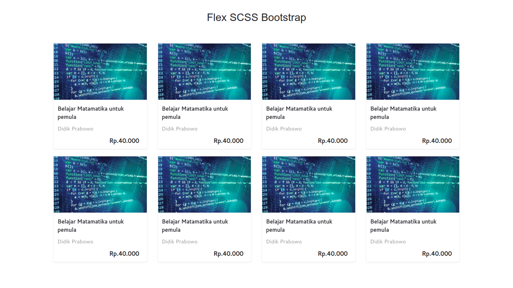

# Build template flex from scss bootsrap

Example build css with scss extends bootstrap

<br>
```
1. git clone https://github.com/didikprabowo/build-template-flex-from-scss-bootsrap.git
2. npm install -g sass
3. sass src/main.scss:style.css 

```